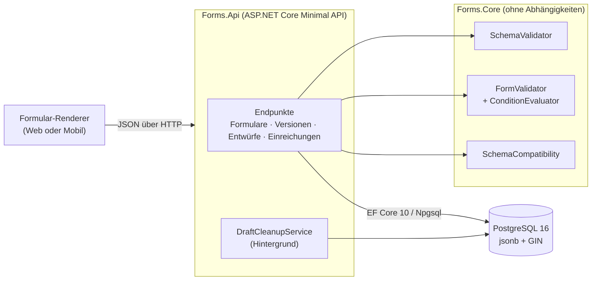

# Forms API

[](https://github.com/AhadPorkar/forms-api-dotnet/actions/workflows/ci.yml)
[](https://dotnet.microsoft.com/)
[](https://www.postgresql.org/)
[](LICENSE)

[English](README.md) · **Deutsch**

Der Backend-Kern eines dynamischen Formular-Builders. Formulare werden als JSON definiert, in
unveränderlichen Versionen veröffentlicht und von Clients ausgefüllt, die während der Eingabe automatisch
speichern. Der Server prüft jede Einreichung gegen genau die Version, für die sie erstellt wurde, und
speichert sie als PostgreSQL-`jsonb`, wo sie nach Inhalt abgefragt werden kann.

Umgesetzt mit .NET 10 (LTS), ASP.NET Core Minimal APIs, EF Core 10 und PostgreSQL 16.
Getestet mit xUnit v3 und Testcontainers gegen eine echte Datenbank.


## Funktionsumfang

| Funktion | Umsetzung |
| --- | --- |
| **Formulare als Daten** | Neun Feldtypen (Text, Langtext, E-Mail, Zahl, Ganzzahl, Boolean, Datum, Auswahl, Mehrfachauswahl) mit Regeln wie Länge, Wertebereich, Datumsfenster, Anzahl der Einträge und Muster. |
| **Bedingte Logik** | Bedingungen `visibleWhen` und `requiredWhen`, verschachtelbar mit `all`/`any`. Ausgeblendete Felder werden nicht geprüft und nicht gespeichert. |
| **Feldübergreifende Regeln** | Zum Beispiel „der letzte Tag darf nicht vor dem ersten Tag liegen“. |
| **Schemaprüfung beim Speichern** | Unbekannte Verweise, Zyklen zwischen Bedingungen, unpassende Regeln und unsichere Muster werden abgelehnt, bevor ein Schema gespeichert wird. |
| **Schema-Versionierung** | Ein bearbeitbarer Entwurf pro Formular. Veröffentlichte Versionen sind unveränderlich, und jede Einreichung ist an ihre Version gebunden. |
| **Erkennung inkompatibler Änderungen** | Jede Änderung zwischen zwei Versionen wird als inkompatibel (breaking) oder kompatibel eingestuft. Ein inkompatibler Entwurf wird nur mit `acceptBreakingChanges=true` veröffentlicht. |
| **Automatisches Speichern** | Entwürfe werden ohne Validierung gespeichert, damit keine Eingabe verloren geht. Die Antwort zeigt, was noch fehlt. ETag und `If-Match` verhindern, dass zwei Browser-Tabs sich gegenseitig überschreiben. |
| **Abfrage nach Inhalt** | `GET /submissions?filter={"leaveType":"sick"}` läuft als `data @> filter` über einen GIN-Index. Die neuesten Ergebnisse kommen zuerst, mit Cursor-Paging. |
| **Betrieb** | OpenAPI 3.1 mit Scalar-Oberfläche, Fehlerantworten nach RFC 9457, Health Checks, JSON-Logs, Größenlimits für Anfragen, ein „chiseled“ Container-Image ohne Root-Rechte und EF-Core-Migrationen. |

## Schnellstart

Voraussetzung: Docker. Für die Entwicklung ohne Docker brauchen Sie das .NET 10 SDK und PostgreSQL 16.

```bash
docker compose up -d --build
bash scripts/smoke-test.sh       # End-to-End-Prüfung: anlegen, veröffentlichen, zwischenspeichern, einreichen, abfragen
```

Die interaktive API-Referenz finden Sie unter <http://localhost:8080/scalar>, das OpenAPI-Dokument unter
`/openapi/v1.json`.

Jedes Release veröffentlicht außerdem ein fertiges Image, sodass der Build entfallen kann:

```bash
docker pull ghcr.io/ahadporkar/forms-api-dotnet:1.0.0   # ebenfalls als 1.0 und latest getaggt
```

Die API aus dem Quellcode gegen die Compose-Datenbank starten:

```bash
docker compose up -d postgres
dotnet run --project src/Forms.Api      # http://localhost:5080, wendet in Development die Migrationen an
```

## Ein Formular in 30 Sekunden

[`samples/leave-request.form.json`](samples/leave-request.form.json) definiert einen Urlaubsantrag. Ein Ausschnitt:

```json
{ "key": "certificateNumber", "label": "Medical certificate number", "type": "text",
  "constraints": { "pattern": "[A-Z]{2}-[0-9]{6}" },
  "visibleWhen":  { "field": "leaveType",   "operator": "equals",      "value": "sick" },
  "requiredWhen": { "field": "workingDays", "operator": "greaterThan", "value": 3 } }
```

Das Feld für die Nummer der Arbeitsunfähigkeitsbescheinigung erscheint nur bei Krankheit und ist erst ab
mehr als drei Arbeitstagen Pflicht.

```bash
curl -X POST localhost:8080/api/forms -H 'Content-Type: application/json' -d @samples/leave-request.form.json
curl -X POST localhost:8080/api/forms/leave-request/versions/draft/publish

curl -X POST localhost:8080/api/forms/leave-request/submissions -H 'Content-Type: application/json' \
  -d '{"data":{"employeeName":"J","leaveType":"sick","workingDays":5}}'
```

Der letzte Aufruf liefert `422` mit allen Fehlern, nicht nur dem ersten:

```json
{
  "title": "The submission is invalid.",
  "status": 422,
  "violations": [
    { "field": "employeeName",      "code": "minLength", "message": "Full name must be at least 2 characters long." },
    { "field": "email",             "code": "required",  "message": "Work email is required." },
    { "field": "startDate",         "code": "required",  "message": "First day is required." },
    { "field": "endDate",           "code": "required",  "message": "Last day is required." },
    { "field": "certificateNumber", "code": "required",  "message": "Medical certificate number is required." }
  ]
}
```

Jeder Fehler hat einen stabilen `code`, damit ein Client eigene, übersetzte Meldungen anzeigen kann.
Weitere Anfragen, auch zum automatischen Speichern mit ETags, stehen in
[`requests/forms-api.http`](requests/forms-api.http). Die Datei läuft in Visual Studio, Rider und VS Code (REST Client).

## API-Überblick

| Methode und Pfad | Zweck |
| --- | --- |
| `POST /api/forms` | Formular anlegen; das Schema wird Version 1 (Entwurf). |
| `GET /api/forms` · `GET /api/forms/{key}` | Formulare auflisten oder ein Formular mit Versionshistorie abrufen. |
| `GET /api/forms/{key}/versions/{n\|latest\|draft}` | Schema einer Version abrufen. |
| `PUT /api/forms/{key}/versions/draft` | Entwurf anlegen oder ersetzen; die Antwort listet die Änderungen gegenüber der neuesten veröffentlichten Version. |
| `POST /api/forms/{key}/versions/draft/publish` | Veröffentlichen; `409` mit Änderungsbericht, wenn der Entwurf inkompatible Änderungen enthält. |
| `GET /api/forms/{key}/versions/compare?from=1&to=2` | Änderungen zwischen zwei Versionen einstufen. |
| `POST /api/forms/{key}/validate` | Probelauf gegen eine beliebige Version, auch gegen den Entwurf. |
| `POST /api/forms/{key}/submissions` | Einreichung prüfen und speichern. |
| `GET /api/forms/{key}/submissions` | Abfrage nach `version`, `filter` (JSON-Containment), `limit` und `after` (Cursor). |
| `POST /api/forms/{key}/drafts` · `PUT /api/drafts/{id}` | Zwischenspeicher-Entwurf anlegen und speichern (`PUT` verlangt `If-Match`). |
| `POST /api/drafts/{id}/submit` | Entwurf prüfen und in einer Transaktion zur Einreichung machen. |

## Architektur



`Forms.Core` enthält alle fachlichen Regeln: das Schemamodell, die Validierung und die Kompatibilitätsanalyse.
Das Projekt hängt weder von ASP.NET Core noch von der Datenbank ab. Es lässt sich deshalb in Millisekunden
testen und wiederverwenden, etwa in einem Kommandozeilenwerkzeug, das Schemas in einer CI-Pipeline prüft.
`Forms.Api` ergänzt HTTP, Persistenz und Betrieb.

Details: [Architektur](docs/architecture.de.md) · [Tests](docs/testing.de.md) ·
[Architekturentscheidungen (englisch)](docs/adr/README.md).

## Entwurfsentscheidungen

| ADR | Entscheidung |
| --- | --- |
| [0001](docs/adr/0001-minimal-apis-with-typed-results.md) | Minimal APIs mit typisierten Ergebnissen statt MVC-Controllern |
| [0002](docs/adr/0002-jsonb-instead-of-eav.md) | Schemas und Einreichungen in `jsonb` statt in einer Entity-Attribute-Value-Tabelle |
| [0003](docs/adr/0003-immutable-published-versions.md) | Veröffentlichte Versionen sind unveränderlich; Einreichungen sind an eine Version gebunden |
| [0004](docs/adr/0004-own-schema-format-instead-of-json-schema.md) | Eigenes Schemaformat und eigene Validierung statt JSON Schema |
| [0005](docs/adr/0005-linear-time-regular-expressions.md) | Reguläre Ausdrücke mit linearer Laufzeit gegen ReDoS |
| [0006](docs/adr/0006-autosave-never-rejects-and-uses-etags.md) | Automatisches Speichern lehnt nie ab; Nebenläufigkeit über `xmin` und ETags |
| [0007](docs/adr/0007-breaking-change-gate-on-publish.md) | Inkompatible Änderungen werden nur mit ausdrücklicher Bestätigung veröffentlicht |
| [0008](docs/adr/0008-integration-tests-with-testcontainers.md) | Integrationstests gegen echtes PostgreSQL mit Testcontainers |
| [0009](docs/adr/0009-uuidv7-keys-and-keyset-paging.md) | UUIDv7-Schlüssel und Keyset-Paging |

## Projektstruktur

```text
src/
  Forms.Core/            Schemamodell, Validierung, Kompatibilitätsanalyse
  Forms.Api/             Endpunkte, EF-Core-Modell und Migrationen, Bereinigung im Hintergrund
tests/
  Forms.Core.Tests/              109 Unit-Tests
  Forms.Api.IntegrationTests/    52 HTTP-Tests gegen PostgreSQL 16 im Container
samples/                 das Urlaubsantrag-Formular aus README, Tests und Smoke-Test
requests/                .http-Datei zum manuellen Ausprobieren
scripts/smoke-test.sh    End-to-End-Prüfung gegen eine laufende Instanz
docs/                    Architektur, Tests, ADRs, Release Notes (Englisch und Deutsch)
```

## Entwicklung

```bash
dotnet build                      # Warnungen sind Fehler; Analyzer auf latest-recommended
dotnet test                       # die Integrationstests brauchen Docker
dotnet format --verify-no-changes
dotnet tool restore && dotnet ef migrations add <Name> -p src/Forms.Api -o Persistence/Migrations
```

Die CI läuft bei jedem Push und Pull Request. Sie prüft die Formatierung, baut, führt beide Testprojekte mit
Coverage aus, baut das Container-Image und startet den Smoke-Test gegen Docker Compose. Außerdem prüft sie
das Markdown. Ein Tag `v*` veröffentlicht das Image in der GitHub Container Registry und erstellt ein GitHub-Release.

## (Noch) nicht enthalten

Authentifizierung und Mandantenfähigkeit, Felder für Datei-Uploads, wiederholbare Gruppen und lokalisierte
Beschriftungen. Das [Architekturdokument](docs/architecture.de.md#erweiterungspunkte) beschreibt, wo diese
Funktionen ansetzen würden.

## Lizenz

[MIT](LICENSE) © 2026 Ahad Porkar
