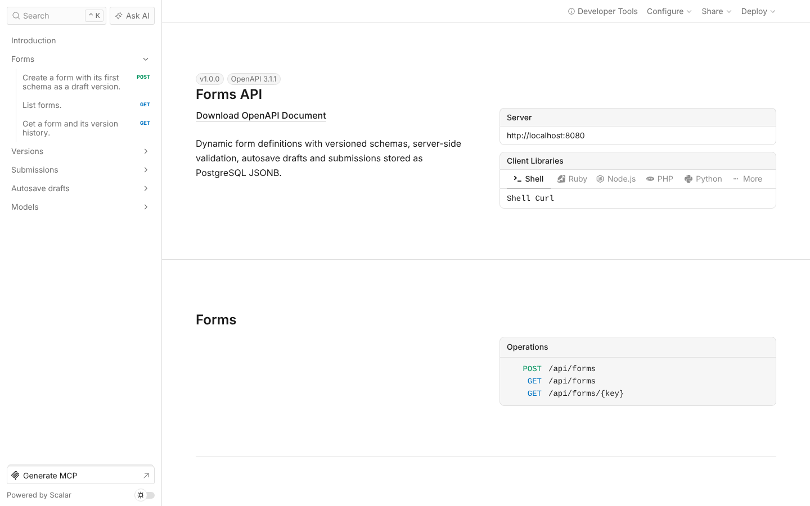
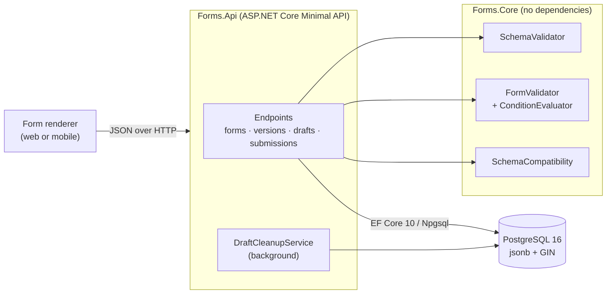

# Forms API

[](https://github.com/AhadPorkar/forms-api-dotnet/actions/workflows/ci.yml)
[](https://dotnet.microsoft.com/)
[](https://www.postgresql.org/)
[](LICENSE)

**English** · [Deutsch](README.de.md)

The backend core of a dynamic form builder. Forms are defined as JSON, published in immutable versions,
and filled in by clients that autosave as the user types. The server validates every submission against the
exact version it was made for and stores it as PostgreSQL `jsonb`, where it can be queried by content.

Built with .NET 10 (LTS), ASP.NET Core Minimal APIs, EF Core 10 and PostgreSQL 16.
Tested with xUnit v3 and Testcontainers against a real database.



## What it does

| Capability | How |
| --- | --- |
| **Form definitions as data** | Nine field types (text, long text, email, number, integer, boolean, date, select, multi-select) with constraints such as length, range, date window, item count and pattern. |
| **Conditional logic** | `visibleWhen` and `requiredWhen` conditions with `all`/`any` nesting. Hidden fields are not validated and are removed from stored data. |
| **Cross-field rules** | For example "the last day cannot be before the first day". |
| **Schema checks on save** | Unknown references, cycles between conditions, constraints that do not fit the type, and unsafe patterns are rejected before a schema is stored. |
| **Schema versioning** | One editable draft per form. Published versions are immutable, and every submission is pinned to its version. |
| **Breaking-change detection** | Each change between two versions is classified as breaking or not. Publishing a breaking draft needs an explicit `acceptBreakingChanges=true`. |
| **Autosave** | Drafts are saved without validation so no input is lost. The response reports what is still missing. ETag and `If-Match` stop two browser tabs from overwriting each other. |
| **Querying by content** | `GET /submissions?filter={"leaveType":"sick"}` runs as `data @> filter` on a GIN index. Results come newest first, with cursor paging. |
| **Operations** | OpenAPI 3.1 with a Scalar UI, RFC 9457 problem details, health checks, JSON logs, request size limits, a chiseled non-root container image, and EF Core migrations. |

## Quick start

Requirements: Docker. For development without Docker you need the .NET 10 SDK and PostgreSQL 16.

```bash
docker compose up -d --build
./scripts/smoke-test.sh          # end-to-end check: create, publish, autosave, submit, query
```

Open <http://localhost:8080/scalar> for the interactive API reference. The OpenAPI document is at
`/openapi/v1.json`.

To run the API from source against the Compose database:

```bash
docker compose up -d postgres
dotnet run --project src/Forms.Api      # http://localhost:5080, applies migrations in Development
```

## A form in 30 seconds

[`samples/leave-request.form.json`](samples/leave-request.form.json) defines a leave request. Here is part of it:

```json
{ "key": "certificateNumber", "label": "Medical certificate number", "type": "text",
  "constraints": { "pattern": "[A-Z]{2}-[0-9]{6}" },
  "visibleWhen":  { "field": "leaveType",   "operator": "equals",      "value": "sick" },
  "requiredWhen": { "field": "workingDays", "operator": "greaterThan", "value": 3 } }
```

The certificate field appears only for sick leave and is required only for absences longer than three days.

```bash
curl -X POST localhost:8080/api/forms -H 'Content-Type: application/json' -d @samples/leave-request.form.json
curl -X POST localhost:8080/api/forms/leave-request/versions/draft/publish

curl -X POST localhost:8080/api/forms/leave-request/submissions -H 'Content-Type: application/json' \
  -d '{"data":{"employeeName":"J","leaveType":"sick","workingDays":5}}'
```

The last call returns `422` with every problem, not just the first one:

```json
{
  "title": "The submission is invalid.",
  "status": 422,
  "violations": [
    { "field": "employeeName",      "code": "minLength", "message": "Full name must be at least 2 characters long." },
    { "field": "email",             "code": "required",  "message": "Work email is required." },
    { "field": "startDate",         "code": "required",  "message": "First day is required." },
    { "field": "endDate",           "code": "required",  "message": "Last day is required." },
    { "field": "certificateNumber", "code": "required",  "message": "Medical certificate number is required." }
  ]
}
```

More requests, including autosave with ETags, are in [`requests/forms-api.http`](requests/forms-api.http).
You can run that file in Visual Studio, Rider or VS Code (REST Client).

## API overview

| Method and path | Purpose |
| --- | --- |
| `POST /api/forms` | Create a form; its schema becomes version 1 (draft). |
| `GET /api/forms` · `GET /api/forms/{key}` | List forms, or get one form with its version history. |
| `GET /api/forms/{key}/versions/{n\|latest\|draft}` | Get a version's schema. |
| `PUT /api/forms/{key}/versions/draft` | Create or replace the draft; the response lists the changes compared with the latest published version. |
| `POST /api/forms/{key}/versions/draft/publish` | Publish; `409` with the change report if the draft has breaking changes. |
| `GET /api/forms/{key}/versions/compare?from=1&to=2` | Classify the changes between two versions. |
| `POST /api/forms/{key}/validate` | Dry run against any version, including the draft. |
| `POST /api/forms/{key}/submissions` | Validate and store a submission. |
| `GET /api/forms/{key}/submissions` | Query by `version`, `filter` (JSON containment), `limit` and `after` (cursor). |
| `POST /api/forms/{key}/drafts` · `PUT /api/drafts/{id}` | Start and save an autosave draft (`If-Match` required on `PUT`). |
| `POST /api/drafts/{id}/submit` | Validate the draft and turn it into a submission in one transaction. |

## Architecture



`Forms.Core` holds all the rules: the schema model, the validation engine and the compatibility analysis.
It has no dependency on ASP.NET Core or the database, so it can be unit-tested in milliseconds and reused,
for example in a CLI that checks schemas in a CI pipeline. `Forms.Api` adds HTTP, persistence and operations.

Details: [architecture](docs/architecture.md) · [testing](docs/testing.md) ·
[architecture decision records](docs/adr/README.md).

## Design decisions

| ADR | Decision |
| --- | --- |
| [0001](docs/adr/0001-minimal-apis-with-typed-results.md) | Minimal APIs with typed results instead of MVC controllers |
| [0002](docs/adr/0002-jsonb-instead-of-eav.md) | Schemas and submissions in `jsonb`, not an entity-attribute-value table |
| [0003](docs/adr/0003-immutable-published-versions.md) | Published versions are immutable; submissions are pinned to a version |
| [0004](docs/adr/0004-own-schema-format-instead-of-json-schema.md) | An own schema format and validation engine instead of JSON Schema |
| [0005](docs/adr/0005-linear-time-regular-expressions.md) | Linear-time regular expressions against ReDoS |
| [0006](docs/adr/0006-autosave-never-rejects-and-uses-etags.md) | Autosave never rejects input; concurrency through `xmin` and ETags |
| [0007](docs/adr/0007-breaking-change-gate-on-publish.md) | Publishing a breaking change needs explicit confirmation |
| [0008](docs/adr/0008-integration-tests-with-testcontainers.md) | Integration tests against real PostgreSQL with Testcontainers |
| [0009](docs/adr/0009-uuidv7-keys-and-keyset-paging.md) | UUIDv7 keys and keyset paging |

## Project layout

```text
src/
  Forms.Core/            schema model, validation engine, compatibility analysis
  Forms.Api/             endpoints, EF Core model and migrations, background cleanup
tests/
  Forms.Core.Tests/              109 unit tests
  Forms.Api.IntegrationTests/    52 HTTP tests against PostgreSQL 16 in a container
samples/                 the leave-request form used by the README, the tests and the smoke test
requests/                .http file for manual exploration
scripts/smoke-test.sh    end-to-end check against a running instance
docs/                    architecture, testing, ADRs, release notes (English and German)
```

## Development

```bash
dotnet build                      # warnings are errors; analyzers at latest-recommended
dotnet test                       # needs Docker for the integration tests
dotnet format --verify-no-changes
dotnet tool restore && dotnet ef migrations add <Name> -p src/Forms.Api -o Persistence/Migrations
```

CI runs on every push and pull request. It checks formatting, builds, runs both test projects with coverage,
builds the container image and runs the smoke test against Docker Compose. It also lints the Markdown.
A `v*` tag publishes the image to the GitHub Container Registry and creates a GitHub release.

## Not in scope (yet)

Authentication and multi-tenancy, file-upload fields, repeating groups, and localised labels.
The [architecture document](docs/architecture.md#extension-points) describes where each of these would fit.

## License

[MIT](LICENSE) © 2026 Ahad Porkar
