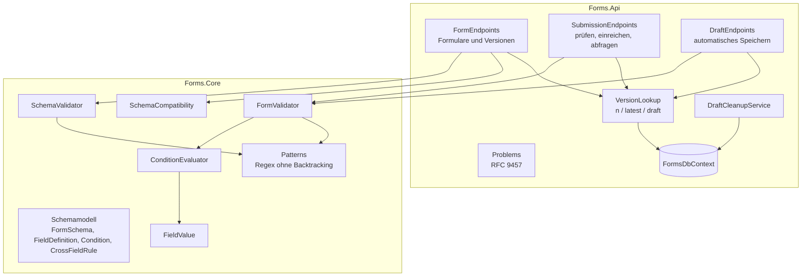
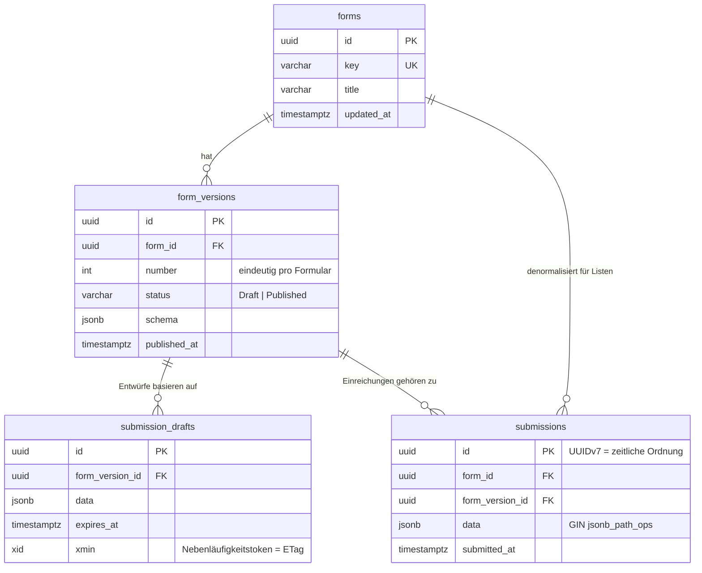
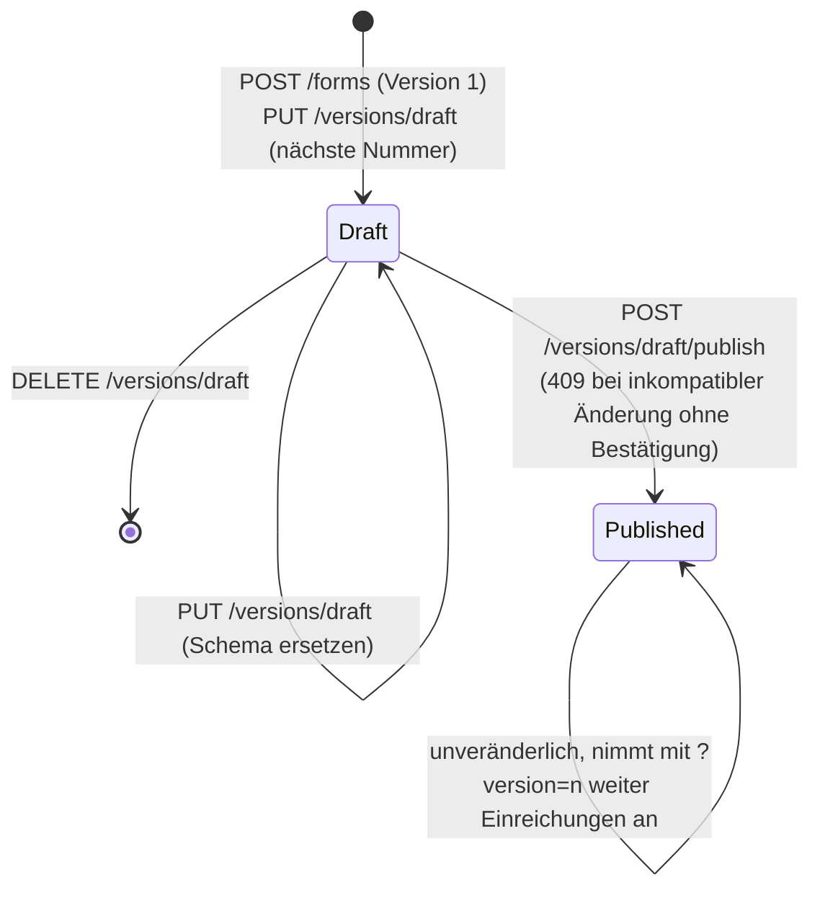
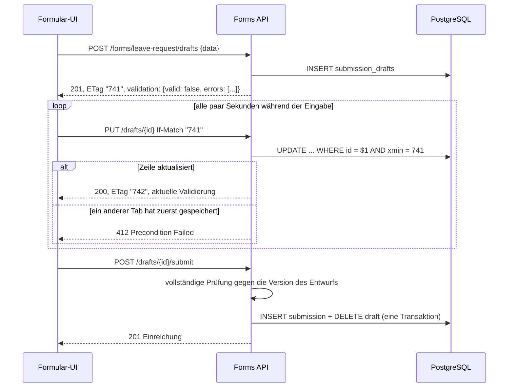

# Architektur

[English](architecture.md) · **Deutsch**

## Kontext

Mit einem Formular-Builder können auch Nicht-Entwickler Eingabemasken definieren, etwa einen Urlaubsantrag,
eine Störungsmeldung oder ein Kunden-Onboarding, ohne dass eine neue Version der Anwendung nötig ist. Damit
verschieben sich drei Probleme von der Compile-Zeit in die Laufzeit:

1. Die **Struktur** der Daten ist beim Schreiben des Codes nicht bekannt.
2. Fachliche **Regeln** (Pflichtfelder, Bedingungen, feldübergreifende Prüfungen) müssen auf dem Server
   durchgesetzt werden, weil dem Client nicht vertraut werden kann.
3. Formulare **ändern sich**, während Daten erfasst werden, und alte Daten müssen lesbar bleiben.

Dieser Dienst löst genau diese drei Probleme. Darstellung, Workflow-Steuerung und Authentifizierung gehören zu
anderen Komponenten.

## Komponenten

| Komponente | Aufgabe |
| --- | --- |
| `FormSchema` und zugehörige Records | Unveränderliche Wertobjekte; eine einzige JSON-Form für API, Datenbank und Tests (`FormSchemaJson`). |
| `SchemaValidator` | Prüft vor dem Speichern, ob ein Schema in sich stimmig ist: Schlüssel, Optionen, zum Typ passende Regeln, Verweise und Werttypen in Bedingungen, Zyklen zwischen `visibleWhen`-Bedingungen, Verschachtelungstiefe, Muster und feldübergreifende Regeln. |
| `FormValidator` | Prüft eingereichte Daten in vier Schritten (siehe unten) und liefert alle Fehler sowie die bereinigten Daten. |
| `ConditionEvaluator` | Wertet Bedingungsbäume aus; ausgeblendete oder leere Felder gelten als leer. |
| `SchemaCompatibility` | Vergleicht zwei Schemas und stuft jede Änderung als inkompatibel oder kompatibel ein. |
| `FormsDbContext` | EF-Core-Modell: vier Tabellen, `jsonb`-Spalten, ein partieller Unique-Index, ein GIN-Index und Nebenläufigkeit über `xmin`. |
| Endpunkt-Klassen | Schlanke HTTP-Adapter. Sie übersetzen Anfragen in Aufrufe des Kerns und Ergebnisse in typisierte HTTP-Antworten. |
| `DraftCleanupService` | Hintergrunddienst, der abgelaufene Entwürfe mit einem `PeriodicTimer` löscht. |

## Validierungsablauf

`FormValidator.Validate(schema, data)`:

1. **Form.** Die Daten müssen ein JSON-Objekt sein. Jede Eigenschaft muss ein Feld des Formulars sein (`unknownField`).
2. **Einlesen.** Jeder Wert wird als sein Feldtyp gelesen (`FieldValue.TryRead`). Texte werden getrimmt, ein
   leerer Text gilt als kein Wert, Zahlen werden als `decimal` gelesen (ohne Rundungsfehler von Gleitkommazahlen),
   und Datumswerte müssen `JJJJ-MM-TT` sein. Ein unpassender Wert ist ein `type`-Fehler.
3. **Sichtbarkeit.** `visibleWhen` wird bei Bedarf ausgewertet und zwischengespeichert. Ein ausgeblendetes Feld
   gilt in allen anderen Bedingungen als leer, das Ausblenden setzt sich also fort. Zyklen hat die Schemaprüfung
   bereits ausgeschlossen.
4. **Feldprüfung.** Nur für sichtbare Felder: Pflicht (`required` oder `requiredWhen`), danach die Regeln.
   Fehler werden gesammelt statt geworfen, damit der Client alles mit einer Anfrage erhält.
5. **Feldübergreifende Regeln.** Sie laufen nur, wenn beide Seiten sichtbar, vorhanden und gültig sind. So
   entstehen keine Folgefehler wie „Ende vor Beginn“, wenn der Beginn gar kein Datum ist.

Das Ergebnis enthält die **normalisierten Daten**: nur sichtbare Felder mit Wert, Texte getrimmt, Zahlen ohne
Nachkommanullen (`5.000` wird `5`), Datumswerte als `JJJJ-MM-TT`. Genau das wird gespeichert. Daten aus
ausgeblendeten Feldern gelangen nie in die Datenbank. Zahlen werden nur dann als `decimal` gelesen, wenn das
`decimal` den Wert exakt hält; eine Zahl, die gerundet würde (`1.00000000000000000000000000001`), ist ein
`type`-Fehler. PostgreSQL-`jsonb` hält Schlüssel in eigener Reihenfolge, eine gespeicherte Einreichung kommt also
inhaltsgleich, aber nicht unbedingt in Schema-Reihenfolge zurück.

## Datenmodell

Die Datenbank sichert die Integrität ab, wo immer das möglich ist:

- `ix_form_versions_one_draft_per_form` ist ein **partieller Unique-Index** (`WHERE status = 'Draft'`). Zwei
  gleichzeitige Anfragen können keine zwei Entwürfe anlegen, unabhängig vom Anwendungscode.
- `(form_id, number)` ist eindeutig; Versionsnummern wiederholen sich nie.
- Einreichungen verweisen mit `ON DELETE RESTRICT` auf ihre Version. Eine Version mit Daten kann nicht verschwinden.

## Lebenszyklus der Versionen

`latest` bezeichnet immer die neueste **veröffentlichte** Version. Einreichungen werden nur für veröffentlichte
Versionen angenommen. Der Prüf-Endpunkt akzeptiert auch `draft`, damit ein Formular vor der Freigabe getestet
werden kann.

## Ablauf beim automatischen Speichern

## Fehlerformat

Jeder Fehler ist ein Problem nach RFC 9457 (`application/problem+json`):

| Status | Wann |
| --- | --- |
| `400` | Fehlerhafte Anfrage: ungültiger Schlüssel, ungültiges `limit`, `filter` ist kein JSON-Objekt, fehlerhaftes `If-Match`, Daten über `Forms:MaxDataBytes` oder JSON, das PostgreSQL nicht speichern kann (NUL-Zeichen, einzelne Surrogate, Zahlen außerhalb des Wertebereichs). |
| `404` | Unbekanntes Formular, unbekannte Version, Entwurf oder Einreichung. Auch abgelaufene Entwürfe liefern `404`. |
| `409` | Doppelter Formularschlüssel, inkompatibler Entwurf ohne Bestätigung veröffentlicht (der Body enthält den Bericht `compatibility`) oder Einreichung für eine nicht veröffentlichte Version. |
| `412` / `428` | Veraltetes oder fehlendes `If-Match` beim Speichern eines Entwurfs. |
| `413` | Request-Body über `Forms:MaxRequestBodyBytes` (1 MiB); Kestrel lehnt ihn ab, bevor er gelesen wird. |
| `422` | Ungültiges Schema (`errors` nach Pfad, etwa `schema.fields[3].visibleWhen.field`) oder ungültige Einreichung (`errors` nach Feld, dazu `violations` mit stabilen Codes). |

## Sicherheit

- **ReDoS.** Muster laufen auf der Regex-Engine von .NET ohne Backtracking, mit linearer Laufzeit
  ([ADR 0005](adr/0005-linear-time-regular-expressions.md)). Muster sind auf 500 Zeichen begrenzt, müssen vor dem
  Verankern für sich allein kompilieren (damit `x)|(?:.*` die Anker nicht verlassen kann) und werden mit `\z` verankert.
- **Ressourcengrenzen.** Request-Bodies sind auf Kestrel-Ebene auf 1 MiB begrenzt (`Forms:MaxRequestBodyBytes`),
  Einreichungsdaten auf 256 KiB (`Forms:MaxDataBytes`). Ein Schema hat höchstens 200 Felder, 500 Optionen pro
  Feld, 100 Regeln und 100 Werte pro `in`-Bedingung; Bedingungen sind höchstens 5 Ebenen tief; eine Seite hat
  höchstens 200 Einträge.
- **Feindliches JSON.** Werte, die gültiges JSON sind, aber weder in .NET-Strings noch in PostgreSQL passen
  (einzelne UTF-16-Surrogate, das NUL-Zeichen, Zahlen wie `1e1000000`), werden vor jeder Verarbeitung mit `400` abgelehnt.
- **Verlorene Updates bei Versionen.** `form_versions` trägt ein `xmin`-Nebenläufigkeitstoken. Eine Anfrage, die
  den Entwurf vor einer gleichzeitigen Veröffentlichung geladen hat, kann das veröffentlichte Schema nicht
  überschreiben; sie erhält `409`.
- **Mass Assignment.** Unbekannte Eigenschaften werden abgelehnt statt stillschweigend gespeichert.
- **SQL-Injection.** EF Core parametrisiert alle Abfragen. Der Containment-Filter geht als `jsonb`-Parameter an
  PostgreSQL.
- **Container.** Das Laufzeit-Image ist ein „chiseled“ Ubuntu: keine Shell, kein Paketmanager, kein Root-Benutzer.
- **Authentifizierung** ist nicht Teil dieses Dienstes (siehe unten).

## Erweiterungspunkte

| Funktion | Ansatzpunkt |
| --- | --- |
| Authentifizierung / Autorisierung | Authentifizierungs-Middleware von ASP.NET Core und `RequireAuthorization()` auf den Routengruppen. Rechte pro Formular als Policy, die den Formularschlüssel liest. |
| Mandantenfähigkeit | Spalte `tenant_id` in `forms` mit einem globalen Abfragefilter in EF Core. Row-Level Security in PostgreSQL als zweite Verteidigungslinie. |
| Lokalisierte Beschriftungen | `Label` wird eine Zuordnung von Sprache zu Text. Fehlermeldungen haben bereits einen `code`, Clients können sie also übersetzen. |
| Wiederholbare Gruppen | Ein Feldtyp `group` mit verschachtelten `fields`. `FieldValue` erhält eine Liste von Objekten, und die Validierung arbeitet rekursiv. |
| Datei-Uploads | Ein Feldtyp `file`, der eine Referenz auf einen Objektspeicher speichert. Der Upload selbst läuft über einen eigenen Endpunkt mit vorsignierter URL. |
| Ereignisse | Eine Transactional-Outbox-Tabelle, die im selben `SaveChanges` wie die Einreichung geschrieben wird, damit eine Workflow-Engine für jede Einreichung einen Prozess starten kann. |
| Export nach JSON Schema | Eine einseitige Abbildung von `FormSchema` auf JSON Schema für Clients, die bereits damit arbeiten ([ADR 0004](adr/0004-own-schema-format-instead-of-json-schema.md)). |
