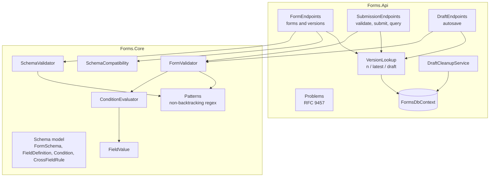
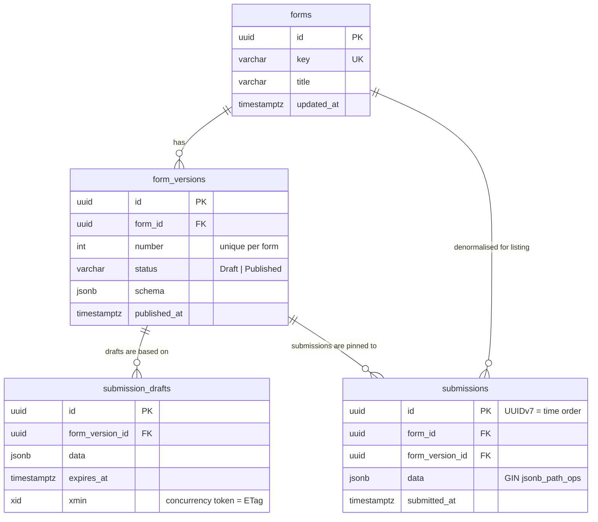
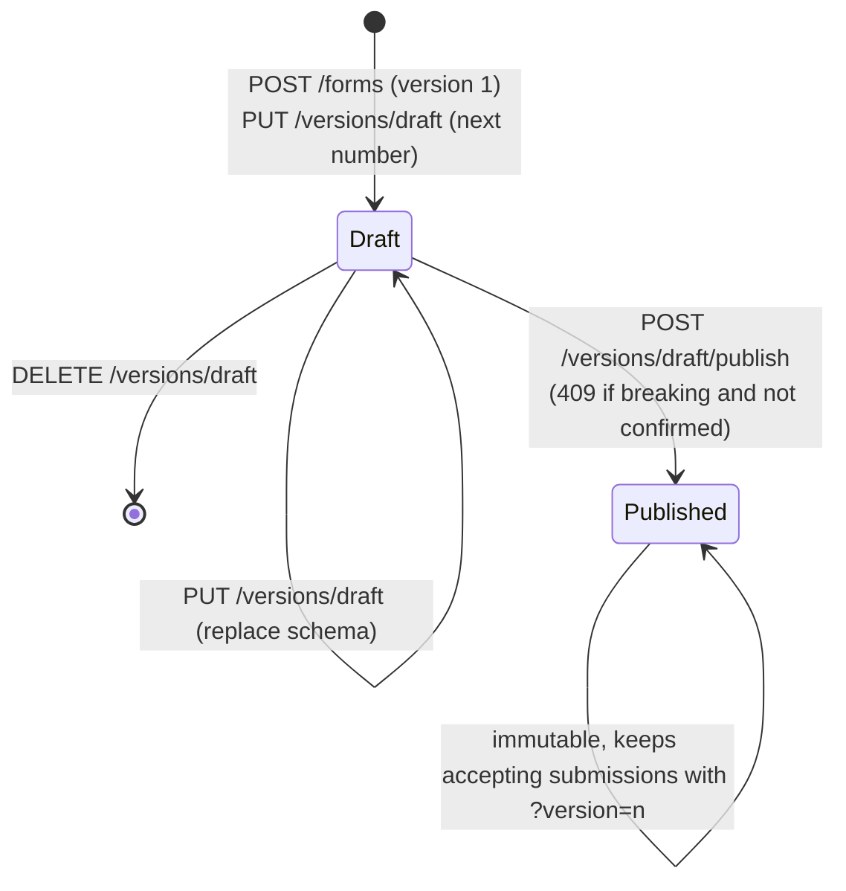
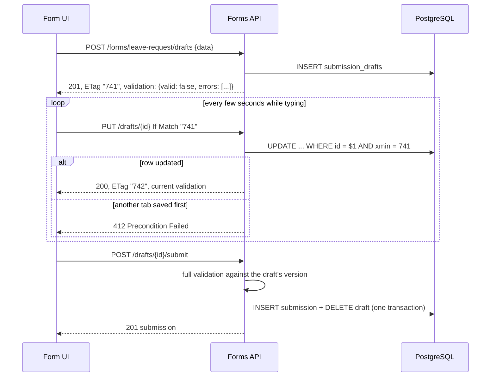

# Architecture

**English** · [Deutsch](architecture.de.md)

## Context

A form builder lets non-developers define data-entry screens, such as a leave request, an incident report or
a customer onboarding form, without a new release of the application. That moves three problems from compile
time to run time:

1. The **structure** of the data is not known when the code is written.
2. Business **rules** (required fields, conditions, cross-field checks) must be enforced on the server, because
   the client cannot be trusted.
3. Forms **change** while data is being collected, and old data must stay readable.

This service solves those three problems and nothing else. Rendering, workflow routing and authentication
belong to other components.

## Components

| Component | Responsibility |
| --- | --- |
| `FormSchema` and related records | Immutable value objects; one JSON shape for the API, the database and the tests (`FormSchemaJson`). |
| `SchemaValidator` | Checks that a schema is consistent before it is stored: keys, options, constraints that fit the type, condition references and value types, cycles between `visibleWhen` conditions, nesting depth, patterns, and rules. |
| `FormValidator` | Validates submitted data in four steps (see below) and returns all errors plus the cleaned data. |
| `ConditionEvaluator` | Evaluates condition trees; it treats hidden or empty fields as empty. |
| `SchemaCompatibility` | Compares two schemas and classifies each change as breaking or not. |
| `FormsDbContext` | EF Core model: four tables, `jsonb` columns, a partial unique index, a GIN index, and `xmin` concurrency. |
| Endpoint classes | Thin HTTP adapters. They map requests to core calls and results to typed HTTP results. |
| `DraftCleanupService` | Hosted service that deletes expired autosave drafts on a `PeriodicTimer`. |

## Validation pipeline

`FormValidator.Validate(schema, data)`:

1. **Shape.** The data must be a JSON object. Every property must be a field of the form (`unknownField`).
2. **Read.** Each value is read as its field type (`FieldValue.TryRead`). Strings are trimmed, an empty string
   counts as no value, numbers are read as `decimal` (no floating-point rounding), and dates must be
   `YYYY-MM-DD`. A value that does not fit is a `type` error.
3. **Visibility.** `visibleWhen` is resolved lazily with memoisation. A hidden field reads as empty in every
   other condition, so hiding cascades. The schema validator has already ruled out cycles.
4. **Field checks.** For visible fields only: required (`required` or `requiredWhen`), then the constraints.
   Errors are collected, not thrown, so the client gets everything in one round trip.
5. **Rules.** Cross-field rules run only when both sides are visible, present and valid. That avoids follow-on
   errors such as "end before start" when the start is not a date.

The result contains the **normalised data**: only visible fields with values, strings trimmed, numbers without
trailing zeros (`5.000` becomes `5`), dates as `YYYY-MM-DD`. This is what gets stored. Data from hidden fields
never reaches the database. Numbers are read as `decimal` only when the decimal holds the exact value; a number
that would be rounded (`1.00000000000000000000000000001`) is a `type` error. PostgreSQL `jsonb` keeps keys in
its own order, so a stored submission reads back with the same content but not necessarily in schema order.

## Data model

Integrity is enforced by the database where it can be:

- `ix_form_versions_one_draft_per_form` is a **partial unique index** (`WHERE status = 'Draft'`). Two concurrent
  requests cannot create two drafts, whatever the application code does.
- `(form_id, number)` is unique, so version numbers never repeat.
- Submissions reference their version with `ON DELETE RESTRICT`. A version that has data cannot disappear.

## Versioning lifecycle

`latest` always means the newest **published** version. Submissions are accepted only for published versions.
The validate endpoint also accepts `draft`, so a form designer can test a schema before releasing it.

## Autosave flow

## Error format

Every error is an RFC 9457 problem (`application/problem+json`):

| Status | When |
| --- | --- |
| `400` | Malformed request: bad key, bad `limit`, `filter` that is not a JSON object, a malformed `If-Match`, a payload over `Forms:MaxDataBytes`, or JSON that PostgreSQL could not store (NUL characters, lone surrogates, numbers out of range). |
| `404` | Unknown form, version, draft or submission. Expired drafts also return `404`. |
| `409` | Duplicate form key, a breaking draft published without confirmation (the body contains the `compatibility` report), or a submission to an unpublished version. |
| `412` / `428` | Stale or missing `If-Match` on a draft update. |
| `413` | Request body over `Forms:MaxRequestBodyBytes` (1 MiB); Kestrel refuses it before it is read. |
| `422` | Invalid schema (`errors` keyed by path, such as `schema.fields[3].visibleWhen.field`) or invalid submission (`errors` by field, plus `violations` with stable codes). |

## Security considerations

- **ReDoS.** Patterns run on .NET's non-backtracking engine, which works in linear time
  ([ADR 0005](adr/0005-linear-time-regular-expressions.md)). Patterns are limited to 500 characters, must compile
  on their own before they are anchored (so `x)|(?:.*` cannot escape the anchors), and are anchored with `\z`.
- **Resource limits.** Request bodies are limited to 1 MiB at the Kestrel level (`Forms:MaxRequestBodyBytes`)
  and submission data to 256 KiB (`Forms:MaxDataBytes`). A schema may have at most 200 fields, 500 options per
  field, 100 rules and 100 values per `in` condition; conditions nest at most 5 levels; a page has at most 200 items.
- **Hostile JSON.** Values that are valid JSON but that .NET strings or PostgreSQL cannot hold (lone UTF-16
  surrogates, the NUL character, numbers such as `1e1000000`) are rejected with `400` before any processing.
- **Lost updates on versions.** `form_versions` carries an `xmin` concurrency token. A request that loaded the
  draft before a concurrent publish cannot overwrite the published schema; it gets `409`.
- **Mass assignment.** Unknown properties are rejected, not silently stored.
- **SQL injection.** All queries are parameterised by EF Core. The containment filter is sent to PostgreSQL as a
  `jsonb` parameter.
- **Container.** The runtime image is chiseled Ubuntu: no shell, no package manager, a non-root user.
- **Authentication** is not part of this service (see below).

## Extension points

| Feature | Where it fits |
| --- | --- |
| Authentication / authorisation | ASP.NET Core authentication middleware plus `RequireAuthorization()` on the route groups. Form-level permissions as a policy that reads the form key. |
| Multi-tenancy | A `tenant_id` column on `forms` with an EF Core global query filter. PostgreSQL row-level security as a second line of defence. |
| Localised labels | `Label` becomes a map from culture to text. Error messages are already identified by `code`, so clients can translate them. |
| Repeating groups | A `group` field type with nested `fields`. `FieldValue` gains an `Items` of objects, and validation recurses. |
| File uploads | A `file` field type that stores a reference to object storage. The upload itself goes through a separate pre-signed URL endpoint. |
| Events | A transactional outbox table written in the same `SaveChanges` call as the submission, so that a workflow engine can start a process for each submission. |
| JSON Schema export | A one-way mapping from `FormSchema` to JSON Schema for clients that already use it ([ADR 0004](adr/0004-own-schema-format-instead-of-json-schema.md)). |
